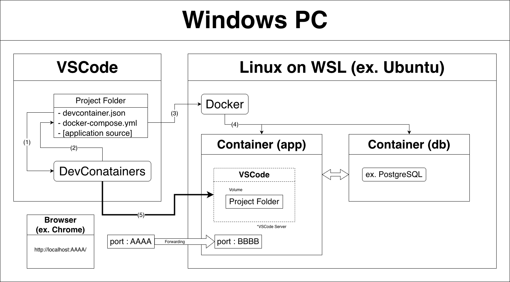
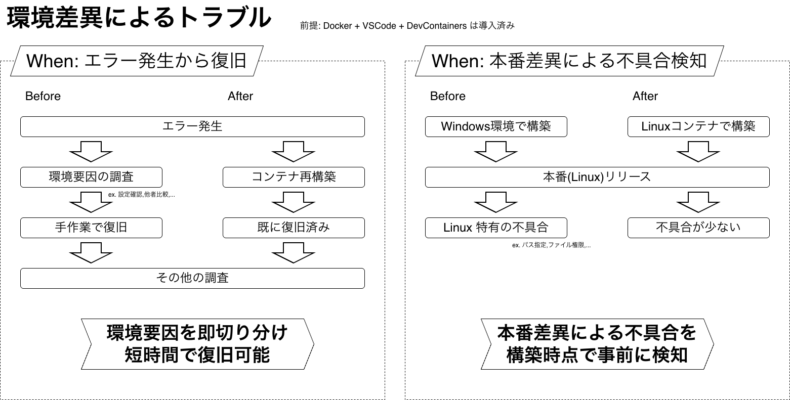
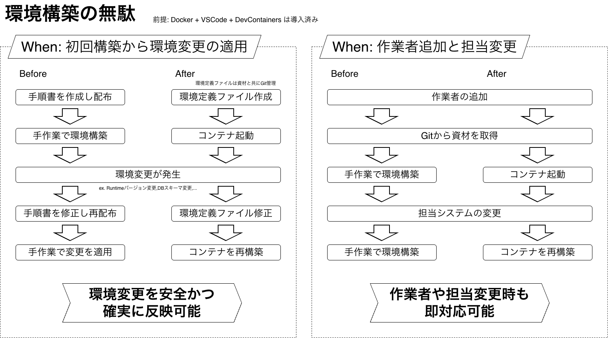

# 開発環境の改善提案

### 環境差異と構築コストの課題を解決する

<!--
本日は、「開発環境の改善提案」ということで、
開発現場で繰り返し起きている、
環境差異 と 構築コスト の課題について、
解決策を提案させていただきます。

このプレゼンの目的は、課題と解決策を整理した上で、
有用性をご検討いただくことですので、
そういった観点でお聞きいただければと思います。
-->

---

## アジェンダ

1. 現状の課題
2. 解決策
3. Before/After
4. 懸念点と向き合い方
5. まとめ

<!--
こちらが本日のアジェンダです。

最初に現状の課題をお話します。
そしてその解決策をお話し、それによる Before/After をお話します。
次に解決策に対する懸念点とその向き合い方をお話して、まとめとなります。

20分程度ですべてお話して、その後に10分程度ご質問をお受けする、という流れを想定しております。
では、よろしくお願いいたします。
-->

---

# 1. 現状の課題

## 1-1. 環境差異によるトラブル

## 1-2. 環境構築に伴う無駄

<!--
まずは現状の課題からお話します。
実際のプロジェクト経験に基づいたものを、大きくふたつお話します。
-->

---

## 1-1. 環境差異によるトラブル

- **バージョン差異による動作不良**  
  OS（Linux Distribution） / Runtime（Java,Python,...） / Tool（Git,CLI,...）
- **既存環境との競合**  
  既存環境の影響 / 使用ポート競合
- **再現性の欠如**  
  ローカルデータ差異 / 環境リセットが困難
- **本番環境との差異**  
  Linux 環境の用意が手間 / フォルダ構成を再現できない
- **設定差異による成果物のブレ**  
  文字コード / 改行コード / 整形設定

<!--
課題のひとつ目は、「環境差異によるトラブル」です。

開発現場では、作業者ごとに環境が微妙に異なることで、
バージョン差異や既存環境との競合によるエラーが発生しがちです。

こうした環境差異があると、エラーが発生した際に
「環境が原因なのか、コードが原因なのか」の切り分けが難しくなり、
再現や復旧に時間がかかります。

さらに、本番環境とローカル環境との差が大きい場合、
ローカル環境では問題なく見えていた不具合に、
リリース後に初めて気付く、というリスクが大きくなります。

また、文字コードや改行コード、整形設定などの設定差異によって、
成果物に差が出てしまうケースも少なくありません。
-->

---

## 1-2. 環境構築に伴う無駄

- **手順書が必要**  
  作成コスト / 更新されない / 属人化
- **構築の工数**  
  新規参加 / 引き継ぎ / サポート対応
- **トラブル**  
  手作業によるミス / 既存環境の影響

<!--
次にふたつ目の課題が、「環境構築に伴う無駄」です。

従来の環境構築では、まず手順書を作成して配布する必要がありますが、
この手順書自体の作成や更新にコストがかかり、
実際には更新されなくなったり、特定の人やその端末に依存してしまうケースが多くあります。

また、新規参加や担当変更のたびに、
各作業者が手順書を見ながら手作業で環境を構築するため、
どうしても時間がかかり、サポート対応の負担も増えがちです。

こうした手作業中心の構築では、
設定ミスや既存環境の影響によるトラブルも発生しやすく、
結果として「環境構築そのもの」に多くの時間を取られてしまいます。
-->

---

# 2. 解決策

### Docker + VSCode + DevContainers

<!--
ここまでで、環境差異によるトラブルや、
環境構築にかかる無駄について整理しました。

これらの課題に対する解決策として、
今回提案したいのが「Docker + VSCode + DevContainers」です。
-->

---

### Docker + VSCode + DevContainers

- Docker コンテナにより、開発環境を高い再現性で構築する
- 環境定義をファイルとして管理し、共有や再利用を容易にする
- VSCode + DevContainers により、従来の開発体験を損なわない

<!--
この構成で実現したいことは、大きく三つあります。

ひとつ目は、Docker コンテナを使って、
開発環境そのものを高い再現性で用意することです。
これにより、作業者ごとの環境差異や本番との差異を最小化できます。

ふたつ目は、その環境をファイルとして定義し、
アプリの資材と一緒に管理することです。
手順書ではなく、コードとして管理することで、
共有や再利用、変更の反映が容易かつ確実になります。

みっつ目は、VSCode と DevContainers を使うことで、
これまでと同じ操作感のまま開発できる点です。
このDocker コンテナを使う、という手法に切り替えても、
日々の開発体験を大きく損なうことは、ありません。
-->

---

<!--
この図が、その構成を用いた開発環境の全体イメージです。

この図でお伝えしたいポイントは、
「開発者の使い勝手はほとんど変わらない」という点です。

全体としては、
Windows PC 上で VSCode を使い、
裏側では WSL 上の Linux、その中で Docker が動いている構成になります。

ただし、作業者が普段意識するのは、
基本的に VSCode だけです。

左側が、普段使っている VSCode です。
プロジェクトフォルダの中には、
アプリのソースコードに加えて、
devcontainer.json や docker-compose.yml といった
環境定義ファイルが含まれています。

DevContainers とは VSCode の拡張機能であり、
これらの環境定義を読み取り、
必要なコンテナを自動的に起動し、接続します。

結果として、
見た目や操作感はいつも通りWindows上の VSCode ですが、
実際の実行(デバッグ)は Docker コンテナの中、という形になります。

今回、細かい仕組みや環境定義ファイルの中身については割愛します。
必要に応じて、別途ハンズオン形式で理解を深める機会をいただければ、と考えています。
-->

---

# 3. Before/After

<!--
次は、その Docker + VSCode + Dev Containers を導入したことで
どのような効果があるのかを、Before/After 形式で、想定されるケースを用いて簡単にお話します。
-->

---

<!--
こちらは課題の「環境差異によるトラブル」に対する Before/After です。

まず左側が、
「エラー発生から復旧まで」のケースです。

従来は、エラーが起きると、
環境要因かどうかを切り分けるために
設定を確認したり、他の作業者の環境と比較したりと、
調査に時間がかかっていました。
復旧も手作業になるため、安定しないケースが多くあります。

一方、After では、
まずコンテナを再構築することで、
環境要因かどうかを即座に切り分けられます。
環境要因であれば、その時点で既に復旧しており、
調査はその他の要因に集中できます。

つまり、
環境要因の切り分けと復旧を、
短時間かつ、確実に行えるようになります。

続いて右側が、
「本番差異による不具合検知」です。

Before では、
Windows 環境で開発し本番環境にリリースします。
本番の Linux 環境で初めて問題が発覚する、
というケースが起こり得ます。

その問題の代表例として、Linuxと仕様が異なる、
パス指定やファイル権限などがあります。

After では、
開発時点から Linux コンテナ上で構築・動作確認を行うため、
本番特有の差異による不具合を、構築時点で事前に検知できます。

結果として、リリース後に初めて気付く問題を、
大きく減らすことができます。

このように、
・トラブル発生時の切り分けと復旧が速くなる
・本番差異による不具合を事前に防げる
という二つの効果が得られます。

これは単なる環境構築の効率化ではなく、
開発の安定性と品質の向上につながる点が
大きなポイントです。
-->

---

<!--
次は課題の「環境構築に伴う無駄」に対する Before/After です。

まず左側が、
「初回構築から環境変更の適用」までの流れです。

Before では、
手順書を作成・配布し、
各作業者が手作業で環境を構築します。
その後、環境変更が発生すると、
手順書を修正して再配布し、
再び手作業で変更を適用する必要があります。

この運用では、
手順書の更新漏れや、手作業による適用ミスが起きやすく、
安全性や確実性に課題があります。

After では、
環境を手順書ではなく、
環境定義ファイルとして作成し、
アプリ資材と一緒に Git で管理します。

資材取得後に、コンテナを起動するだけで環境が整い、
環境変更が発生した場合も、環境定義ファイルを修正して Git に反映、
各自は Git の最新資材を取得して、コンテナを再構築するだけです。

これにより、
環境変更を安全かつ確実に反映できるようになります。

次に右側が、
「作業者追加や担当変更」のケースです。

Before では、
作業者が増えたり、担当システムが変わるたびに、
手順書を見ながら手作業で環境を構築する必要があります。

このため、
人が増えるほど構築コストが増え、
トラブルも発生しやすくなります。

After では、
作業者が追加された場合、Git から資材を取得し、
VSCode でコンテナを起動するだけです。

担当システムが変わった場合も、
同様にコンテナを再構築するだけで対応できます。

人の入れ替わりや役割変更があっても、
環境構築で詰まることがなくなります。

このように、
・環境変更を安全かつ確実に反映できる
・作業者追加や担当変更にも即対応できる
といった、
継続的な開発・運用に強い環境を実現できます。
-->

---

# 4. 懸念点と向き合い方

<!--
ここからは、導入にあたって想定される懸念点と、
それにどう向き合うかを整理します。

まず前提として、この手法は万能ではありません。
そのため、現実的な懸念を事前に洗い出した上で、
適切に扱うことが重要だと考えています。

以降で、大きく6つお話いたします。
-->

---

- **セットアップとバージョン管理**
  VSCode / Git / WSL / Docker の初期セットアップとバージョン統一が必要  
  → 端末ごとに初回のみ対応すれば以降は再利用可能
- **ライセンスの関係で Docker Desktop（GUI）が使えない**
  VSCode から WSL に接続し、CLI ベースで docker コマンドを利用  
  ※ Podman は現時点では採用しない
- **Docker の学習コスト**
  コンテナ技術はモダン開発で必須となりつつあり、  
  中長期的にエンジニアの一般スキルとして必要

<!--
まずは、初期セットアップやバージョン管理が必要になる、ということです。
VSCode、Git、WSL、Docker が最小で想定されるセットアップです。

ただ、VSCodeとGitは一般的に開発で利用するものですし、
WSLとDockerのセットアップは、かなりシンプルな手順になっております。
また、これは端末ごとに一度対応すれば、以降は再利用可能なものになります。

次に、ライセンスの関係で
Docker Desktop が使えない点についてです。

Docker Desktop は、
Docker を GUI ベースで操作できるアプリケーションですが、
ライセンスの都合上、利用できないケースがあります。

この場合の代替としては、VSCode から WSL に接続し、
CLI ベースで docker コマンドを利用する形になります。
GUI は使えませんが、実際の運用上、大きな支障はありません。

また、Docker Desktop の代替として
よく挙げられるものに Podman がありますが、
今回は Podman は採用しない前提としています。
この点についての詳細な理由はここでは割愛しますので、
ご興味のある方は、別途お声がけいただければと思います。

少し話はそれますが、そもそも Docker やコンテナ技術は、
サーバーレスやモダン開発といった現在の開発トレンドの中で、
エンジニアとして避けて通れない技術になりつつあります。

また、
Docker 自体の学習コストについても懸念はありますが、
コンテナ技術はすでにモダン開発では必須になりつつあり、
CLI による操作も含めて、こうした技術を身につけることは、
中長期的にはエンジニアの一般スキルと考えています。
-->

---

- **Windows 環境をコンテナで再現するのは不向き**
  VisualStudio を利用すれば十分対応可能
- **ネイティブアプリ開発には不向き**
  Windows アプリは VisualStudio で対応可能  
  モバイルアプリは本提案の対象外とする
- **公式イメージが存在しない場合がある**
  必要に応じて Dockerfile で再現可能  
  エミュレータが提供されているケースも多い(AWS,GCP)

<!--
次に、Windows 環境そのものをコンテナで再現するケースについてです。
こちらは、基本的にあまり向いていないと考えています。

理由のひとつは、
Windows 系の OS や IIS、SQL Server といったミドルウェアなどをコンテナ化すると、
メモリや CPU など、端末に求められるスペック水準が高くなりやすい点です。

特に開発端末上でこれを行う場合、パフォーマンスや安定性の面で、
デメリットの方が大きくなるケースが多くあります。

もうひとつの理由として、
そもそも開発端末自体が Windows である、という前提があります。

Windows 向けのアプリケーション開発については、
ネイティブ、Web のいずれにおいても、
Visual Studio が非常に完成度の高い開発環境を提供しています。

そのため、
Windows 環境をあえてコンテナで再現するメリットは限定的であり、
Visual Studio を利用する方が合理的だと考えています。

次に、ネイティブアプリ開発についてです。

Windows 向けのネイティブアプリは、
前述の通り Visual Studio を利用すれば問題ありません。

一方、モバイルアプリ開発については、
macOS が必要になるなどの制約もあるため、
本提案の対象外としています。

ただし、
ネイティブアプリ開発における
バックエンドやデータベースについては、
本提案の開発環境を活用すべき領域だと考えています。

最後に、
公式の Docker イメージが存在しないケースについてです。

Docker イメージとは、
Docker コンテナを構築する際のベースとなる環境のことで、
例えば PostgreSQL には公式イメージが提供されています。

公式イメージが存在しない場合でも、
必要に応じて Dockerfile を作成して再現することが可能です。
また、AWS や GCP などのクラウドサービスでも、
各種サービスのエミュレータが、Docker イメージとして提供されているケースも多くあります。

このように、
無理にすべてを Docker 化するのではなく、
適用範囲を限定した上で導入することで、
リスクを抑えつつ、効果を得ることができると考えています。
-->

---

# 5. まとめ

<!--
最後にまとめです。
-->

---

Docker + VSCode + DevContainers により
環境を **コードとして管理** し、**再現性・切り分け・復旧性** を大きく改善できる

それにより開発環境の以下の課題が解決する

- **「環境差異によるトラブル」**
- **「環境構築とその変更に伴う無駄」**

<!--
この Docker + VSCode + Dev Containers を導入することで、
開発環境を手順書ではなく、コードとして管理できるようになります。

これにより、環境の再現性が高まり、
トラブル発生時の切り分けや復旧も、
短時間かつ確実に行えるようになります。

その結果、
これまで課題になっていた
「環境差異によるトラブル」や
「環境構築や変更に伴う無駄」を
大きく削減できます。

まずは次のプロジェクトで試すという機会をいただければと考えております。
-->
